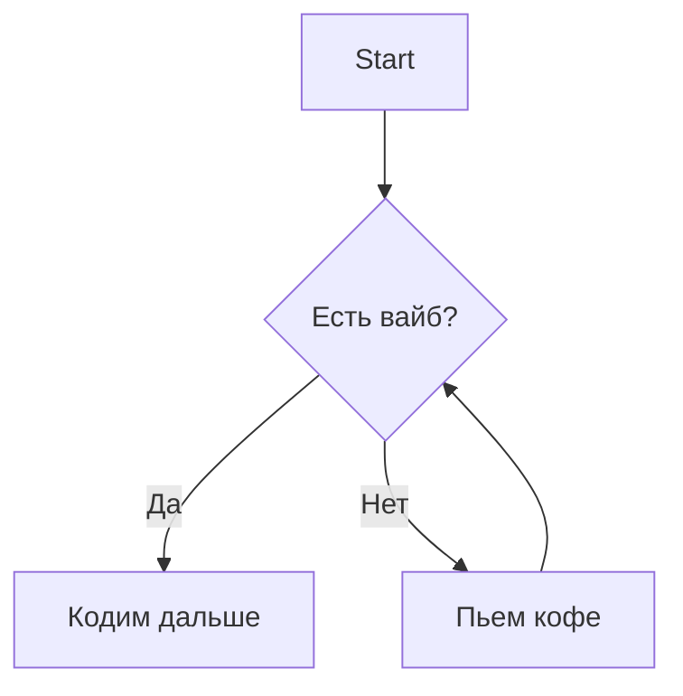

***

# Задание: VibeCoding & Visualization (Mermaid + LLM)

## 🌊 Описание
В рамках дисциплины по **вайбкодингу** мы учимся не писать код руками с нуля, а эффективно управлять потоком создания продукта с помощью ИИ. Важная часть этого процесса — быстрая визуализация архитектуры и логики.

**Задача:** Освоить синтаксис **Mermaid** (язык разметки для диаграмм) через делегирование рутины LLM-чатам (ChatGPT, Claude, DeepSeek и др.).

### Что такое Mermaid?
Это инструмент, который позволяет создавать диаграммы и схемы, используя простой текст и код. Гитхаб умеет рендерить их автоматически.

**Простой пример Flowchart:**


## 🎯 Что нужно сделать

Необходимо сгенерировать и сохранить **5 разных диаграмм** (Sequence, Flowchart, ER-diagram, Class diagram, Gantt, Mindmap и т.д.).

**Источники данных для схем:**
1. **Приоритет:** Логика, архитектура или процессы из ваших **текущих учебных проектов** или хакатонов.
2. **Запасной вариант:** Если своего проекта нет, используйте кейсы из файла `data/cases.md` в этом репозитории.

### ⚠️ Обязательное требование
Каждая диаграмма должна явно содержать **ваш никнейм** (в заголовке, в подписи, или как узел графа).
*Пример:* Узел `User["Student_Nick"]` или подпись `subgraph "Author: @nickname"`.

## 📂 Структура работы и артефакты

Мы работаем в Git. Результаты складываем в папку `artifacts`. Для каждой из 5 диаграмм нужно создать 3 файла.

Рекомендуемая структура файлов:

```text
root/
├── README.md             # Итоговый отчет
├── data/
│   └── cases.md          # Примеры кейсов (если нет своих)
└── artifacts/
    ├── diagram_1_chat.md   # Промпт и ответ LLM
    ├── diagram_1_code.md   # Чистый код Mermaid
    ├── diagram_1.png       # Картинка (экспорт из редактора)
    ├── diagram_2_chat.md
    ...
```

### Детально по файлам в `artifacts`:

1.  **`*_chat.md`**: Файл с логом вашего общения с нейросетью.
    *   *Что писать:* Ваш промпт (например: "Построй Sequence диаграмму для процесса авторизации...") и ответ нейросети.
    *   *Зачем:* Чтобы видеть, как вы формулировали задачу для AI.
2.  **`*_code.md`**: Файл, содержащий только блок кода Mermaid.
    *   Используйте разметку:
    ```text
        
        ```mermaid
        Ваш код здесь
        ```
    ```

3.  **`*.png` (или jpg)**: Итоговое изображение диаграммы.
    *   *Как получить:* Вставьте код, полученный от AI, в [Mermaid Live Editor](https://mermaid.live/), нажмите "Actions" -> "Download PNG".

## 📝 Оформление отчета (README.md)

В корневом файле `README.md` напишите краткий отчет.

**Содержание отчета:**
1.  **Список выбранных диаграмм:** Краткое пояснение, почему вы выбрали именно эти типы схем и какие процессы они описывают (1-2 предложения на каждую).
2.  **Визуализация:** Вставьте полученные `.png` изображения в отчет, чтобы их можно было посмотреть без перехода в папки.

Пример вставки картинки в Markdown:
```markdown
### Диаграмма 1: Авторизация пользователя
Описывает flow входа в приложение через Telegram.


```

***

## 🚀 Алгоритм выполнения (Vibe-режим)

1.  Открываем любимый LLM-чат.
2.  Пишем промпт: *"Представь, что ты системный архитектор. Напиши мне код для Mermaid диаграммы (тип диаграммы), которая описывает (суть процесса). Обязательно добавь на схему блок с подписью 'Author: Moй_NickName'"*.
3.  Копируем код в [Mermaid Live Editor](https://mermaid.live/), проверяем, что всё рендерится красиво. Если нет — просим чат исправить.
4.  Скачиваем PNG.
5.  Сохраняем промпт, код и картинку в `artifacts`.
6.  Повторяем 5 раз.
7.  Оформляем `README.md`.
8.  `git commit` -> `git push` (делаем запрос на слияние).
9.  Убеждаемся что галочки зелёные в CI/CD