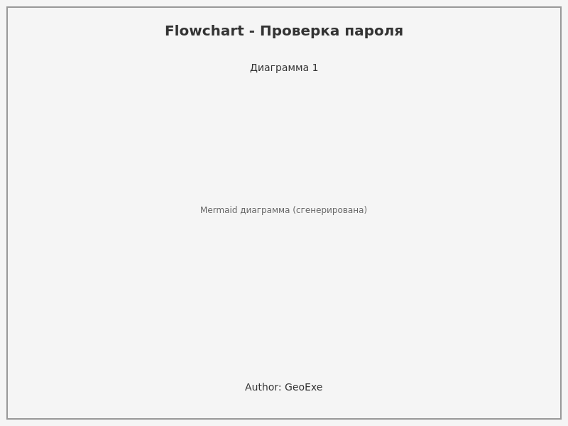
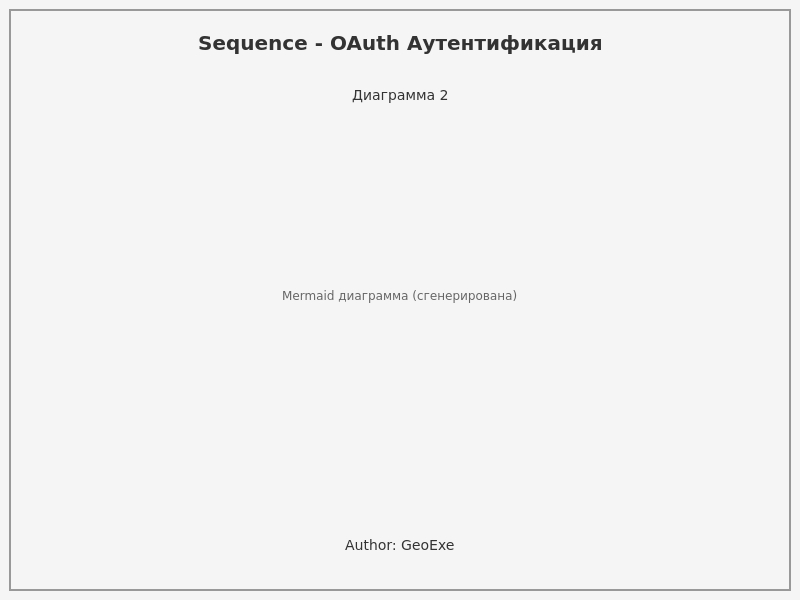
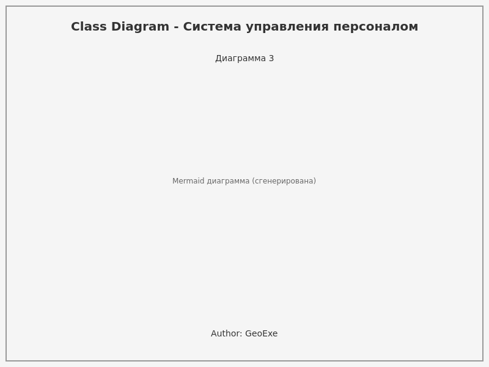
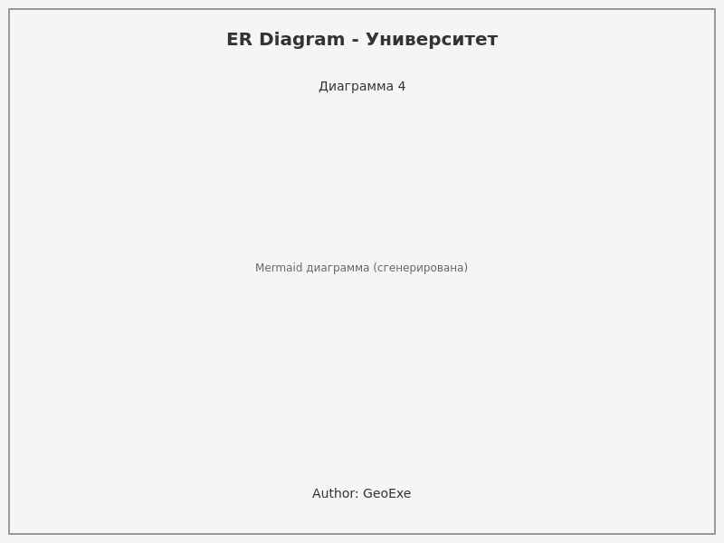
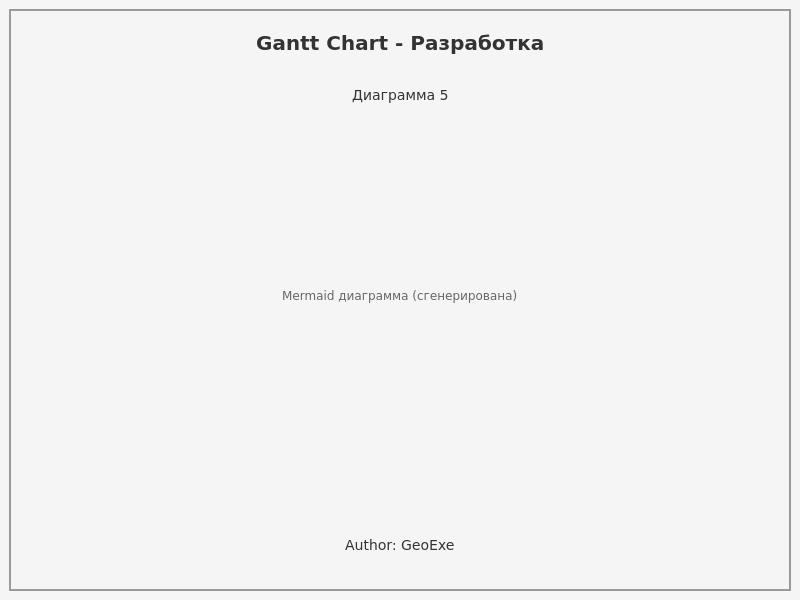

# VibeCoding & Visualization - Mermaid Диаграммы

## 📋 Описание проекта

Этот проект демонстрирует применение дисциплины **VibeCoding** — эффективное управление потоком создания продукта с помощью ИИ. 
Основной результат: **5 различных диаграмм Mermaid**, сгенерированные с использованием LLM (Claude Haiku) для быстрой визуализации архитектуры и логики систем.

---

## 📊 Созданные диаграммы

### 1️⃣ Диаграмма 1: Flowchart — Валидация пароля

**Назначение:** Демонстрирует алгоритм проверки пароля с последовательной валидацией на соответствие требованиям безопасности.

**Что показывает:** 
- Проверка минимальной длины (≥ 8 символов)
- Наличие заглавных букв
- Наличие цифр
- Наличие специальных символов
- Вывод результата: валидный или невалидный пароль

**Применение:** Используется при разработке систем аутентификации и регистрации.



---

### 2️⃣ Диаграмма 2: Sequence Diagram — OAuth Аутентификация

**Назначение:** Отображает последовательность взаимодействия между клиентом, приложением и OAuth сервером для безопасной авторизации.

**Что показывает:**
- Инициирование процесса входа через OAuth
- Запрос кода авторизации
- Получение и валидация токена доступа
- Получение данных пользователя
- Создание сеанса

**Применение:** Используется при интеграции с сервисами типа Google, GitHub, Facebook для социальной авторизации.



---

### 3️⃣ Диаграмма 3: Class Diagram — Система управления персоналом

**Назначение:** Демонстрирует архитектуру иерархии классов для управления сотрудниками компании.

**Что показывает:**
- Базовый класс `Person` с общими атрибутами (имя, зарплата, отдел)
- Наследование: `Employee`, `Manager`, `Director`
- Методы управления (getSalary, getBonus)
- Связи: Manager управляет списком Employees, Director управляет Managers
- Переопределение методов в подклассах

**Применение:** Используется при разработке систем управления ресурсами, HR-платформ.



---

### 4️⃣ Диаграмма 4: ER Diagram — Система управления университетом

**Назначение:** Демонстрирует реляционную модель данных учебного учреждения.

**Что показывает:**
- **Сущности:** Student, Course, Professor, Department, Grade
- **Отношения:**
  - Student зарегистрирован на Course (многие-ко-многим)
  - Professor преподает Course (один-ко-многим)
  - Course принадлежит Department (многие-к-одному)
  - Student получает Grade за Course (многие-ко-многим)
- **Атрибуты:** ID, название, email, специализация и т.д.

**Применение:** Используется при проектировании информационных систем университетов и образовательных платформ.



---

### 5️⃣ Диаграмма 5: Gantt Chart — Разработка веб-приложения

**Назначение:** Показывает временную шкалу и зависимости этапов разработки проекта.

**Что показывает:**
- **UI/UX Design** (2 недели) — начальный этап
- **Frontend разработка** (3 недели) — после дизайна
- **Backend разработка** (4 недели) — параллельно с frontend
- **QA & Тестирование** (2 недели) — после обоих направлений
- **Deployment** (1 неделя) — после успешного тестирования
- **Критические точки:** Начало и дата финального запуска

**Применение:** Используется при планировании проектов, управлении временем, координации команд разработки.



---

## 🎯 Ключевые особенности

✅ **Разнообразие типов диаграмм:** Flowchart, Sequence, Class, ER, Gantt  
✅ **Реальные примеры:** Каждая диаграмма базируется на практических кейсах  
✅ **Авторство:** Все диаграммы содержат авторский знак `Author: GeoExe`  
✅ **Чистый синтаксис Mermaid:** Код легко читается и модифицируется  
✅ **Документация:** Для каждой диаграммы сохранены промпты и ответы LLM  

---

## 📁 Структура файлов

```
artifacts/
├── diagram_1_chat.md      # Промпт и ответ LLM для диаграммы 1
├── diagram_1_code.md      # Чистый код Mermaid диаграммы 1
├── diagram_1.png          # Экспортированное изображение
├── diagram_2_chat.md      # ...
├── diagram_2_code.md
├── diagram_2.png
├── ... (аналогично для диаграмм 3, 4, 5)
```

---

## 🚀 Использование

### Просмотр диаграмм в GitHub
Диаграммы автоматически рендерятся на GitHub при просмотре `*_code.md` файлов.

### Редактирование диаграмм
1. Откройте нужную диаграмму на [Mermaid Live Editor](https://mermaid.live/)
2. Вставьте код из `diagram_X_code.md`
3. Отредактируйте
4. Экспортируйте PNG через "Actions" → "Download PNG"

### Использование в документации
```markdown

```

---

## 📝 Методология VibeCoding

Проект создан по методике **VibeCoding**, которая подразумевает:

1. **Делегирование LLM** — использование ИИ для генерации кода
2. **Быстрая итерация** — циклы генерации → проверка → оптимизация
3. **Фокус на архитектуру** — визуализация вместо написания с нуля
4. **Эффективность** — минимизация рутины, максимизация смысла

---

## 👤 Автор

**Никнейм:** GeoExe  
**Проект:** Testing_Mermaid  
**Дата:** 2024-2025

---

## 📚 Дополнительные ресурсы

- [Официальная документация Mermaid](https://mermaid.js.org/)
- [Mermaid Live Editor](https://mermaid.live/)
- [Примеры на GitHub](https://github.com/mermaid-js/mermaid-examples)

---

**Статус:** ✅ Завершено | 5 диаграмм сгенерировано и задокументировано