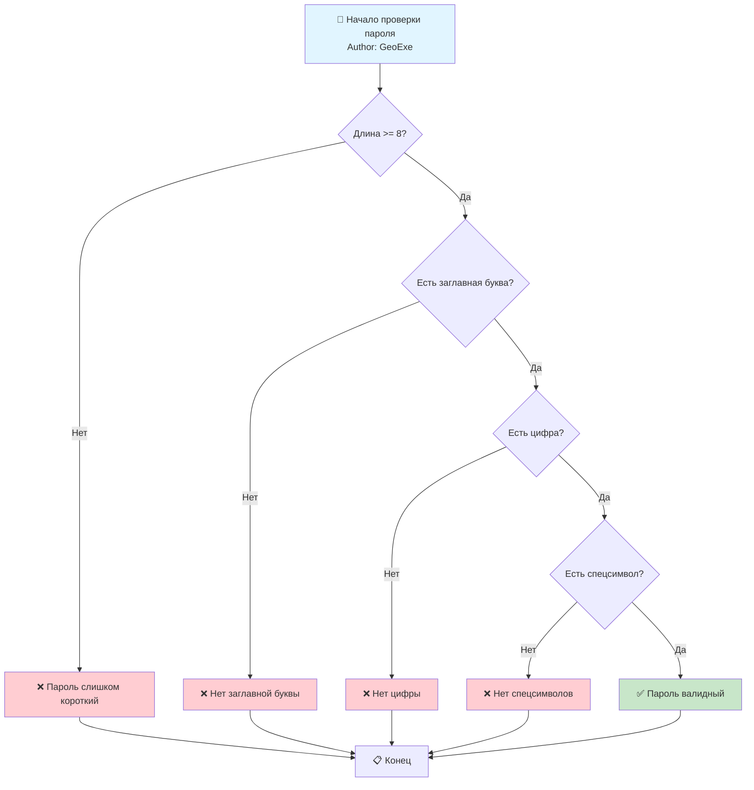

# Диаграмма 1: Flowchart - Проверка пароля

## Промпт:
Представь, что ты системный архитектор. Напиши мне код для Mermaid диаграммы типа Flowchart, которая описывает алгоритм проверки пароля с проверкой на длину (≥8), наличие заглавной буквы, цифры и спецсимволов. На выходе должны быть варианты: валидный пароль или невалидный. Обязательно добавь на схему блок с подписью 'Author: GeoExe'.

## Ответ (сгенерировано Claude Haiku):

