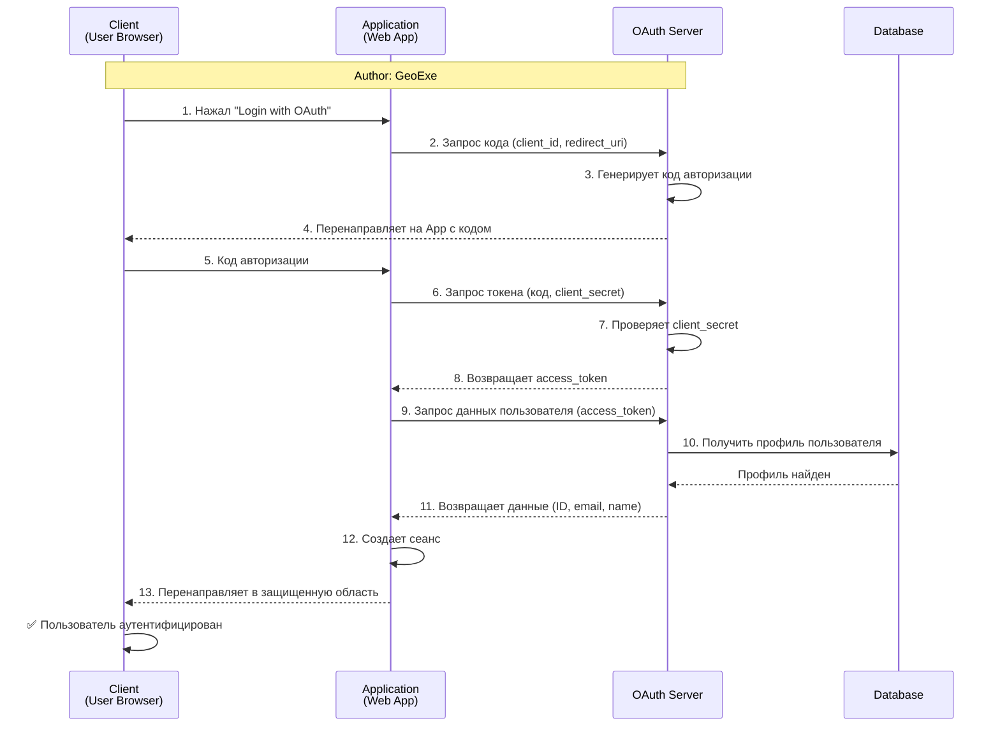

```mermaid
sequenceDiagram
    participant Client as Client<br/>(User Browser)
    participant App as Application<br/>(Web App)
    participant OAuth as OAuth Server
    participant DB as Database
    
    Note over Client,OAuth: Author: GeoExe
    
    Client->>App: 1. Нажал "Login with OAuth"
    App->>OAuth: 2. Запрос кода (client_id, redirect_uri)
    OAuth->>OAuth: 3. Генерирует код авторизации
    OAuth-->>Client: 4. Перенаправляет на App с кодом
    Client->>App: 5. Код авторизации
    App->>OAuth: 6. Запрос токена (код, client_secret)
    OAuth->>OAuth: 7. Проверяет client_secret
    OAuth-->>App: 8. Возвращает access_token
    App->>OAuth: 9. Запрос данных пользователя (access_token)
    OAuth->>DB: 10. Получить профиль пользователя
    DB-->>OAuth: Профиль найден
    OAuth-->>App: 11. Возвращает данные (ID, email, name)
    App->>App: 12. Создает сеанс
    App-->>Client: 13. Перенаправляет в защищенную область
    Client->>Client: ✅ Пользователь аутентифицирован
```
