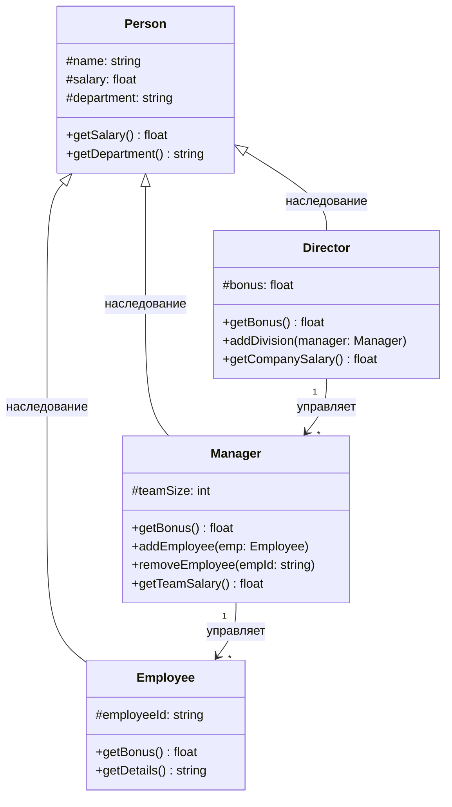

# Диаграмма 3: Class Diagram - Система управления персоналом

## Промпт:
Представь, что ты системный архитектор. Напиши мне код для Mermaid диаграммы типа Class Diagram, которая описывает систему управления персоналом. Включи базовый класс Person с атрибутами (name, salary, department), классы-наследники Employee, Manager и Director. Добавь методы getSalary() и getBonus(). Покажи связь где Manager имеет список Employees. Обязательно добавь комментарий 'Author: GeoExe'.

## Ответ (сгенерировано Claude Haiku):

