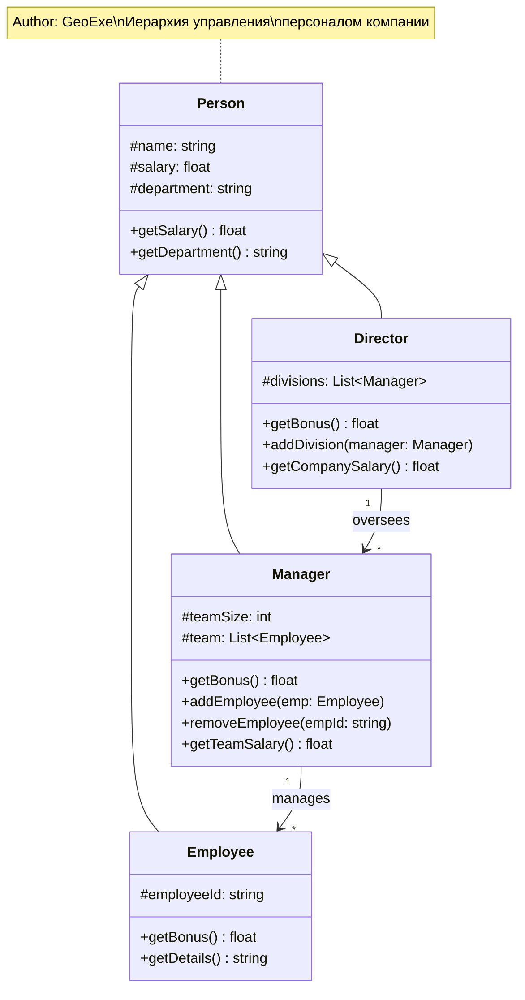

```mermaid
classDiagram
    class Person {
        #name: string
        #salary: float
        #department: string
        +getSalary() float
        +getDepartment() string
    }
    
    class Employee {
        #employeeId: string
        +getBonus() float
        +getDetails() string
    }
    
    class Manager {
        #teamSize: int
        #team: List~Employee~
        +getBonus() float
        +addEmployee(emp: Employee)
        +removeEmployee(empId: string)
        +getTeamSalary() float
    }
    
    class Director {
        #divisions: List~Manager~
        +getBonus() float
        +addDivision(manager: Manager)
        +getCompanySalary() float
    }
    
    Person <|-- Employee
    Person <|-- Manager
    Person <|-- Director
    Manager "1" --> "*" Employee: manages
    Director "1" --> "*" Manager: oversees
    
    note for Person "Author: GeoExe\nИерархия управления\nперсоналом компании"
```
