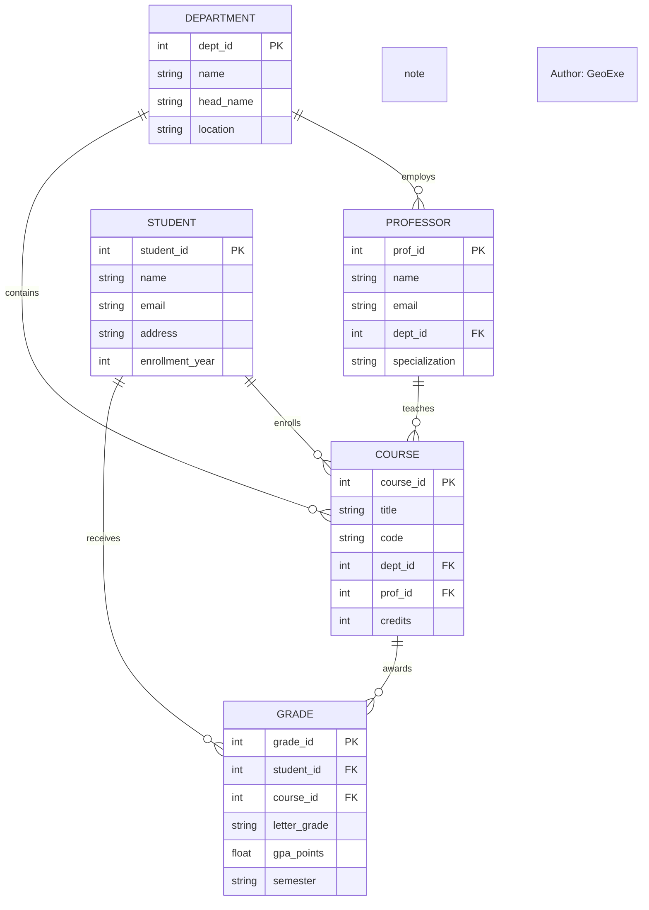

# Диаграмма 4: ER Diagram - Система управления университетом

## Промпт:
Представь, что ты системный архитектор. Напиши мне код для Mermaid диаграммы типа ER Diagram, которая описывает систему управления университетом. Включи сущности: Student, Course, Professor, Department, Grade. Покажи отношения: Student зарегистрирован на Course, Professor преподает Course, Course принадлежит Department, Student получает Grade за Course. Добавь основные атрибуты каждой сущности. Обязательно добавь комментарий 'Author: GeoExe'.

## Ответ (сгенерировано Claude Haiku):

