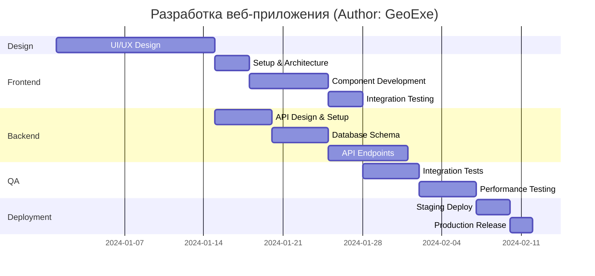

# Диаграмма 5: Gantt Chart - Разработка веб-приложения

## Промпт:
Представь, что ты системный архитектор. Напиши мне код для Mermaid диаграммы типа Gantt Chart, которая описывает этапы разработки веб-приложения. Включи: Дизайн (2 недели) → Фронтенд разработка (3 недели, после дизайна) → Бэкенд разработка (4 недели, параллельно с фронтенд) → Тестирование (2 недели, после обоих) → Развертывание (1 неделя). Покажи зависимости и параллельные процессы. Добавь комментарий 'Author: GeoExe' в заголовок.

## Ответ (сгенерировано Claude Haiku):

